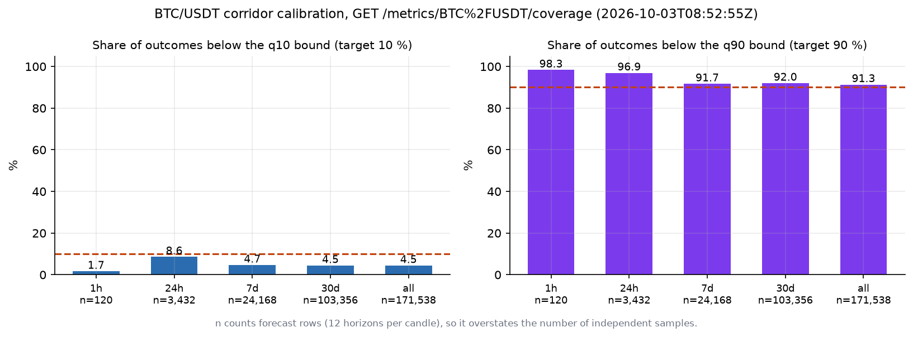
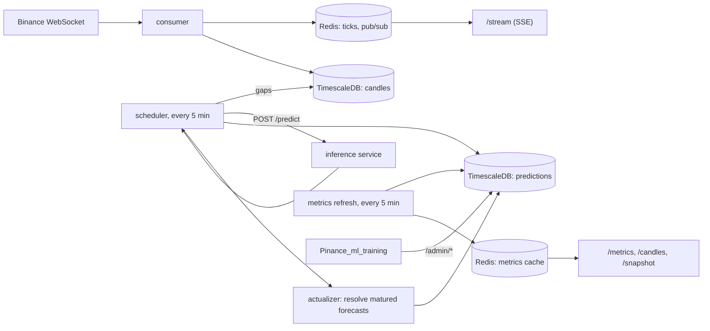

# Pinance Backend

Data and API layer of **Pinance**, a real-time crypto price-forecasting system. It ingests market data, asks the ML inference service for forecasts every five minutes, stores them, checks each one against what actually happened, and serves the live chart and the model-quality metrics to the web UI.

Live deployment: <https://pinance.katzer.ru/> (BTC, ETH, SOL, BNB against USDT). It may run an earlier build than this repository.



*What the backend serves about its own forecasts: calibration of the 10 %/90 % corridor for BTC/USDT, from `GET /metrics/BTC%2FUSDT/coverage` on 2026-10-03 ~08:52 UTC (live, read-only). Over long windows the lower bound is hit 4.5 % of the time against a 10 % target. Drawn by [`docs/figures/make_figures.py`](docs/figures/make_figures.py) from the committed response.*

> **Not a trading signal and not financial advice.** Forecasting crypto on a 5-minute horizon is close to the limit of predictability. This service exists to measure that honestly.

## What this project demonstrates

- **A forecast pipeline that cannot lose a forecast silently.** Missing forecasts are found by a query (candles with no row in `predictions`) and re-requested; the request is self-contained, so repeating it is safe. This replaced a pull design that lost every poll that failed. [Details](docs/design-decisions.md#1-the-backlog-is-a-query-and-the-request-is-self-contained)
- **Every forecast is scored against reality, by the backend.** Directional accuracy for BTC/USDT: **52.5 %** over all 236,314 resolved rows (19,700 candles, about 68 days), 52.4 % over the last 24 h (3,432 rows); measured 2026-10-03, rows overlap in time, so the honest interval is roughly +/- 0.7 pp for the long window and +/- 5.8 pp for 24 h. [Method and caveats](docs/metrics.md)
- **Safe model updates.** A candidate model's forecasts are stored next to production's under a separate `slot` and compared on identical outcomes through `GET /admin/metrics/{symbol}/compare`; the training pipeline decides promotion from that.
- **Real incidents, written down with their fixes.** A cache refresh that starved forecast polling (about 20-25 % of production rows lost), a join-on-read that ran for 20+ minutes at about a million rows, a watermark that could outrun the data. [Design decisions](docs/design-decisions.md)
- **Honest about what it lacks:** no automated tests, no drift endpoint, no authentication on the admin API (network-level protection only). See [Limitations](#limitations).

## Contents

[Idea](#idea) · [Features](#features) · [How it works](#how-it-works) · [Results and evaluation](#results-and-evaluation) · [Quick start](#quick-start) · [Usage examples](#usage-examples) · [Configuration](#configuration) · [API](#api) · [Repository layout](#repository-layout) · [Tests and quality](#tests-and-quality) · [Deployment](#deployment) · [Limitations](#limitations) · [Related repositories](#related-repositories) · [License and credits](#license-and-credits)

Further reading in `docs/`:

| File | What is there |
|---|---|
| [docs/architecture.md](docs/architecture.md) | component diagram, one forecast tick as a sequence, SSE fan-out, data model (ER diagram), Redis keys, scheduled jobs |
| [docs/design-decisions.md](docs/design-decisions.md) | eleven decisions with what was tried before, incidents, trade-offs and what was not done |
| [docs/metrics.md](docs/metrics.md) | exact definition of every metric, live BTC/USDT values with sample sizes, how to read them |
| [docs/api.md](docs/api.md) | every route with parameters, real responses and error cases; CLI tools |
| [docs/deployment.md](docs/deployment.md) | compose services, startup sequence, full configuration table, what is and is not verified |

## Idea

A forecasting demo usually stops at the forecast. The interesting part is what happens afterwards: was it right, how wrong, is the stated uncertainty honest, and is the new model better than the one in production. That needs a layer that remembers every forecast, matches it with the candle that later arrives, and keeps the comparison cheap enough to show to many viewers at once.

This backend is that layer. Three ideas shape it:

1. **The database is the work queue.** What still needs forecasting is whatever candles lack a forecast row. Outages and restarts leave gaps that the next tick fills, with no extra queue to operate.
2. **Resolve once, read cheaply.** The realised price, return and hit/miss are written onto the forecast row once, when the target candle exists, so metric queries are range scans on one table.
3. **Production and candidate share one table, separated by a key.** A new model can be judged live, on the same outcomes, without the user ever seeing it.

## Features

**Market data**
- One Binance WebSocket connection for four symbols (5-minute klines). Every update goes to Redis (latest tick and pub/sub); each closed candle is upserted into TimescaleDB. Reconnects with backoff 1 s to 60 s. [Code](app/ingest/binance_ws.py)
- Candle backfill from Binance REST: automatic for the last 2 days at container start, or on demand, `python -m app.backfill.run --days 7`. [Code](app/backfill/run.py)

**Forecasting**
- Every 5 minutes (second 10) the scheduler finds candles of the last 48 h without a production forecast, builds the request (last 150 candles, plus the BTC window for altcoins) and calls `POST /predict/{symbol}` on the inference service. Result: 12 horizons (5 to 60 minutes), a point forecast and a 10 %/90 % corridor, model and corridor versions, inference time. One failing candle does not stop the others. [Code](app/scheduler/jobs.py), [predictor](app/inference/predictor.py)
- Optional shadow job for the candidate model, stored under `slot = 'candidate'` and never published. `ML_SHADOW_ENABLED=true`.

**Scoring**
- The actualizer resolves matured forecasts (both slots) with a point `UPDATE` and publishes the production ones to Redis for the live feed. Forecasts that are filled late are resolved right after the gap fill. [Code](app/ingest/actualizer.py)
- `python -m app.backfill.resolve_predictions` fills outcomes for old rows in batches.

**Serving**
- `GET /stream/{symbol}`: Server-Sent Events with `tick`, `prediction`, `result` and keep-alive `ping`; one Redis subscription per symbol, one in-process queue per client. `GET /snapshot/{symbol}` for the first paint. [Code](app/api/stream.py)
- `GET /candles/{symbol}`: five timeframes (1D 5m, 1W 15m, 1M 1h from Binance REST, 1Y and ALL as daily aggregates in TimescaleDB), plus the resolved forecast trail and a paged prediction log. [Code](app/api/candles.py)
- `GET /metrics/{symbol}/...`: summary over five windows (accuracy, MAE, RMSE, delta, Sharpe of a simulated long/short), corridor coverage, hourly history, error and width histograms, predicted-vs-actual scatter with R2, inference latency percentiles, and the retrain timeline. A scheduled job keeps these in Redis, so many viewers cost one computation per cycle. [Code](app/api/metrics.py)

**For the training pipeline** (private network)
- `GET /admin/metrics/{symbol}/compare`: production against candidate on the same outcomes, grouped by model version, and corridor coverage grouped by corridor version.
- `POST /admin/retrain-events`: journal of promote/reject decisions, shown as the retrain timeline. [Code](app/api/admin.py)

**Operations**
- `/health` (liveness) and `/ready` (PostgreSQL and Redis). Structured logs (`structlog`, console in dev, JSON in prod). Alembic migrations applied on container start.

## How it works



Full diagrams (component view, tick sequence, fan-out, ER) are in [docs/architecture.md](docs/architecture.md). Key design decisions, in one line each:

| Decision | Reason |
|---|---|
| Backlog = `candles LEFT JOIN predictions` | a failed tick delays a forecast instead of losing it |
| Polling and cache refresh are separate jobs | the refresh once outgrew the interval and caused skipped polls |
| Outcome written at maturity, not joined at read | the all-time window query ran 20+ minutes at ~1M rows |
| `slot` in the primary key, `model_version` a label | version-in-key made production rows disappear from reads |
| Corridor versioned separately from the point model | they are retrained and promoted independently |
| Actualizer bounded by the newest stored candle | a clock-based bound could advance the watermark past a candle not yet written |
| One Redis subscription per symbol | per-client subscriptions exhaust the connection pool |

Rejected or left undone: a separate message queue, backend-side drift monitoring, authentication on the admin API, a test suite ([why](docs/design-decisions.md#considered-and-not-done)).

## Results and evaluation

Live metrics for BTC/USDT, `GET /metrics/BTC%2FUSDT/summary`, captured 2026-10-03 08:50 UTC ([raw JSON](docs/examples/live/summary.json)). `n` counts forecast rows: 12 per candle, with overlapping targets.

| Window | Directional accuracy | n (rows) | candles | approx. 95 % interval* | MAE (USDT) |
|---|---|---|---|---|---|
| 24 h | 52.4 % | 3,432 | 286 | +/- 5.8 pp | 126.22 |
| 7 d | 52.2 % | 24,168 | 2,014 | +/- 2.2 pp | 143.91 |
| 30 d | 52.7 % | 103,356 | 8,613 | +/- 1.1 pp | 141.26 |
| all (about 68 days) | 52.5 % | 236,314 | 19,700 | +/- 0.7 pp | 128.62 |

\* Binomial approximation with candles, not rows, as the unit; my calculation from the values above, not an API field. It ignores autocorrelation, so the real uncertainty is larger.

- Direction is right slightly more often than a coin flip over long windows. The edge is small, and the simulated Sharpe ratio changes sign between windows (+2.81, +0.96, -2.38, +0.59 for 24 h, 7 d, 30 d, all; fees ignored), so there is no basis for a trading claim.
- The corridor is **not** calibrated over long windows: the lower bound is exceeded by 4.5 % of outcomes against a 10 % target (q90: 91.3 % against 90 %, n = 171,538 rows). That is visible in the figure at the top and in [docs/metrics.md](docs/metrics.md#corridor-calibration).
- Inference latency over 24 h: p50 118.4 ms, p95 722.1 ms, p99 864.5 ms (n = 286 calls).
- The retrain timeline on the live site records decisions such as `rejected` for a candidate whose directional accuracy equalled production's; it is a record of the gating, not a quality claim ([sample](docs/examples/live/retrain-timeline.json)).

Offline walk-forward results, baselines and the list of failed ideas live in the training repository. The live numbers here are the production-side check of the same model.

## Quick start

**1. Read-only against the public deployment (nothing to install).** Executed on 2026-10-03; real output is in [Usage examples](#usage-examples).

```bash
curl -s https://pinance.katzer.ru/health
curl -s "https://pinance.katzer.ru/metrics/BTC%2FUSDT/summary"
```

**2. The `/admin/*` endpoints on synthetic data, no Docker.** Executed on 2026-10-03 (Linux, Python 3.12, uv 0.12.18). This starts a throw-away plain PostgreSQL 16 from the `pgserver` package, creates the tables from the models, inserts synthetic candles and forecasts, resolves them with the repository's own script and serves the admin and metrics routers.

```bash
git clone https://github.com/GKatzer/Pinance_backend.git && cd Pinance_backend
uv venv .venv && uv pip install -p .venv -r requirements.txt pgserver
.venv/bin/python docs/examples/admin_offline_demo.py          # serves on 127.0.0.1:8099 until Ctrl-C
```
```bash
curl -s '127.0.0.1:8099/admin/metrics/BTC%2FUSDT/compare?window=24h'
```

Startup output of the demo script:

```
seeded 700 candles and 12312 prediction rows
Backfilling predictions 2026-09-30 22:35:00 .. 2026-10-03 07:50:00 in 24h batches, 0.0s pause between batches
  [2026-09-30 22:35:00 .. 2026-10-01 22:35:00) -> 3456 rows resolved (total 3456)
  [2026-10-01 22:35:00 .. 2026-10-02 22:35:00) -> 6168 rows resolved (total 9624)
  [2026-10-02 22:35:00 .. 2026-10-03 22:35:00) -> 2688 rows resolved (total 12312)
Done. 12312 rows resolved.
serving admin + metrics routers on http://127.0.0.1:8099
```

**3. The full stack with Docker.** *Not run in the environment where this README was written (no access to the Docker daemon); `docker compose config` with these files renders a valid configuration.* Requirements: Docker with Compose, outbound access to Binance, and an inference service for forecasts.

```bash
cp .env.example .env                                                  # set POSTGRES_PASSWORD and ML_INFERENCE_URL
cp docker-compose.override.yml.example docker-compose.override.yml    # local ports instead of the private-network binding
docker compose up -d
curl -s 127.0.0.1:8002/ready
```

On start the container applies the migrations, backfills the last two days of candles and launches the API on port 8000 (published on `127.0.0.1:8002` by the override file). Without an inference service, candles, the tick stream and candle endpoints work; no forecasts are stored. More in [docs/deployment.md](docs/deployment.md).

```bash
.venv/bin/python -m app.backfill.run --days 7 --symbols BTCUSDT ETHUSDT    # load more history
.venv/bin/python -m app.backfill.resolve_predictions                        # one-off resolve of old forecasts
```

## Usage examples

All outputs below are real responses from the public deployment, captured 2026-10-03 and stored in [`docs/examples/live/`](docs/examples/live/); long arrays are shortened with `...`.

```bash
curl -s https://pinance.katzer.ru/health
```
```json
{"status":"ok"}
```

```bash
curl -s "https://pinance.katzer.ru/metrics/BTC%2FUSDT/latency?window=24h"
```
```json
{"window":"24h","n":286,"p50":118.4,"p95":722.1,"p99":864.5}
```

```bash
curl -s "https://pinance.katzer.ru/metrics/BTC%2FUSDT/coverage"
```
```json
{"windows":{"1h":{"n":120,"q10_coverage":0.0167,"q90_coverage":0.9833},"24h":{"n":3432,"q10_coverage":0.086,"q90_coverage":0.9691},"7d":{"n":24168,"q10_coverage":0.0468,"q90_coverage":0.9168}, ...,"all":{"n":171538,"q10_coverage":0.0445,"q90_coverage":0.9131}},"updated_at":"2026-10-03T08:50:05.914270Z"}
```

```bash
curl -s "https://pinance.katzer.ru/candles/BTC%2FUSDT/prediction_log?limit=12"
```
```json
{"symbol":"BTC/USDT","log":[{"as_of_ts":"2026-10-03T08:40:00","horizon":1,"target_ts":"2026-10-03T08:45:00","r_pred":6.449983468888114e-06,"price_pred":84626.17583567486,"price_q10":84595.45517228224,"price_q90":84657.4165018278,"actual_r":0.00010433646830767344,"actual_price":84634.46,"hit":true,"model_version":"202610021348-4de49a70"}, ...],"has_more":true}
```

The live stream across a candle boundary (abridged; the full sample is [`sse-boundary.txt`](docs/examples/live/sse-boundary.txt)):

```bash
curl -N "https://pinance.katzer.ru/stream/BTC%2FUSDT"
```
```
event: tick
data: {"symbol": "BTC/USDT", "ts": 1791018300000, "closed": false, "open": 84641.15, "high": 84641.15, "low": 84641.14, "close": 84641.15, "volume": 0.39327}

event: prediction
data: {"symbol": "BTC/USDT", "as_of_ts": "2026-10-03T09:00:00+00:00", "close": 84641.15, "model_version": "202610021348-4de49a70", "quantile_model_version": "202610021525-4de49a70", "schema_version": "38b98fc7516d", "feature_count": 93, "predictions": [{"horizon": 1, ...}, ... 12 items]}

event: result
data: {"as_of_ts": "2026-10-03T08:45:00", "horizon": 3, "target_ts": "2026-10-03T09:00:00", "r_pred": -1.0898127730102512e-06, ...}
```

Unsupported input and missing endpoint (live):

```
GET /metrics/DOGE%2FUSDT/summary      -> 400 {"detail":"Invalid symbol"}
GET /metrics/BTC%2FUSDT/drift         -> 404 {"detail":"Not Found"}
```

Production against a candidate, on **synthetic** data from the offline demo (the numbers carry no information about any model; real `/admin` output could not be captured because the endpoint is not reachable through the public domain):

```bash
curl -s '127.0.0.1:8099/admin/metrics/BTC%2FUSDT/compare?window=24h'
```
```json
{"symbol":"BTC/USDT","windows":{"24h":{"production":{"202610020300-demoprod":{"n":2946,"directional_accuracy":58.6,"mae":88.75,"rmse":112.52}},"candidate":{"202610030300-democand":{"n":2946,"directional_accuracy":58.6,"mae":89.13,"rmse":113.17}},"quantiles":{"production":{"q-202609270430":{"n":2946,"q10_coverage":0.3031,"q90_coverage":0.7098}},"candidate":{"q-202610030430":{"n":2946,"q10_coverage":0.2037,"q90_coverage":0.8082}}}}},"updated_at":"2026-10-03T08:57:26.362882Z"}
```

## Configuration

Read by [`app/config.py`](app/config.py) from the environment, then from `.env`. Full table with the Docker-related variables: [docs/deployment.md](docs/deployment.md#configuration).

| Variable | Meaning | Default | Required |
|---|---|---|---|
| `DATABASE_URL` | async SQLAlchemy URL | none (compose builds it from `POSTGRES_*`) | yes |
| `REDIS_URL` | Redis URL | `redis://redis:6379/0` | no |
| `ML_INFERENCE_URL` | base URL of the inference service | none | yes |
| `ML_INFERENCE_TIMEOUT_S` | timeout of one inference call | `5.0` | no |
| `ML_POLL_INTERVAL_MINUTES` | forecast job period | `5` | no |
| `ML_CANDLE_WINDOW_SIZE` | candles per request; at least the inference service's minimum | `150` | no |
| `ML_GAP_LOOKBACK_HOURS` | how far back missing forecasts are searched | `48` | no |
| `METRICS_REFRESH_INTERVAL_MINUTES` | cache refresh period | `5` | no |
| `ML_SHADOW_ENABLED` | also poll the candidate model | `false` | no |
| `APP_ENV`, `LOG_LEVEL` | `dev` or `prod` log format; log level | `dev`, `INFO` | no |
| `DB_POOL_SIZE`, `DB_MAX_OVERFLOW` | connection pool | `5`, `5` | no |
| `POSTGRES_DB`, `POSTGRES_USER`, `POSTGRES_PASSWORD` | database container and URL (compose only) | `pinance`, `pinance`, none | password: yes |

## API

Summary; parameters, real responses and error cases for every route are in [docs/api.md](docs/api.md).

| Endpoint | Description |
|---|---|
| `GET /stream/{symbol}`, `GET /snapshot/{symbol}` | live stream of ticks, forecasts and resolved results; initial state |
| `GET /candles/{symbol}?timeframe=1D\|1W\|1M\|1Y\|ALL` | candles for the chart |
| `GET /candles/{symbol}/latest` | latest tick from Redis |
| `GET /candles/{symbol}/pred_history`, `/prediction_log` | resolved forecasts for the chart trail and the log table |
| `GET /metrics/{symbol}/summary`, `coverage`, `history`, `coverage_history`, `errors`, `width_histogram`, `scatter`, `latency`, `retrain-timeline` | model-quality metrics |
| `GET /admin/metrics/{symbol}/compare` | candidate against production (private network only) |
| `POST /admin/retrain-events` | journal of retrain and promotion decisions (private network only) |
| `GET /health`, `GET /ready`, `GET /` | liveness, readiness, service name |

`{symbol}` is `BTC/USDT`, `ETH/USDT`, `SOL/USDT` or `BNB/USDT` (also `BTC-USDT`, `BTCUSDT`, URL-encoded). The application serves interactive OpenAPI at `/docs` when run locally.

## Repository layout

```
app/
  main.py          application setup and lifespan (Redis, scheduler, WebSocket consumer); CORS
  config.py        settings from the environment
  api/
    candles.py     candles, forecast trail, prediction log
    metrics.py     summary, coverage, histograms, latency, retrain timeline; cache refresh
    admin.py       compare, retrain-events (private network)
    stream.py      SSE fan-out and snapshot
    health.py      /health, /ready
  ingest/
    binance_ws.py  WebSocket consumer: ticks to Redis, closed candles to the database
    actualizer.py  resolves matured forecasts, publishes production results
  scheduler/
    jobs.py        forecast polling, shadow polling, metrics cache refresh (APScheduler)
  inference/
    predictor.py   client of the inference service, persistence of forecasts
    registry.py    supported pairs and symbol normalisation
  backfill/        candle backfill (run.py) and one-off resolve of old forecasts (resolve_predictions.py)
  core/            Redis clients, logging
  db/              SQLAlchemy models, session, Alembic migrations (14 revisions, one head)
docs/
  architecture.md, design-decisions.md, metrics.md, api.md, deployment.md
  figures/make_figures.py       draws docs/media/*.png from docs/examples/live/*.json
  examples/live/                real read-only responses from the public deployment, 2026-10-03
  examples/admin-offline/       admin responses from the real code on synthetic data
  examples/admin_offline_demo.py  the Docker-free demo (plain PostgreSQL via `pgserver`)
  media/                        figures
Dockerfile, docker-compose.yml, docker-compose.override.yml.example, entrypoint.sh
.env.example, requirements.txt, alembic.ini, LICENSE
```

`pyproject.toml` exists but is empty; dependencies are pinned in `requirements.txt`. About 4,100 lines of Python outside migrations.

## Tests and quality

There is **no automated test suite**, no linter configuration and no CI in this repository. What was checked:

| Check | Result |
|---|---|
| `python -m compileall app` | passes |
| `alembic heads` | one head, `d9e4b6f8c3a5` (14 revisions) |
| application imported, route table listed (`app.routes`) | 20 application routes plus FastAPI's `/docs`, `/openapi.json`, `/docs/oauth2-redirect`; all documented in [docs/api.md](docs/api.md) |
| `/admin/*` and `app.backfill.resolve_predictions` run against synthetic data | work as documented ([demo](docs/examples/admin_offline_demo.py)) |
| `docker compose config` | valid with `.env.example` and the override file |
| Migrations on TimescaleDB, image build, `docker compose up` | not run (no Docker access) |

## Deployment

Three containers (TimescaleDB, Redis, the API) on one internal network; the API listens on port 8000; the compose file publishes the database and API ports on a private-network address so the training host can reach them, and the override file rebinds them to localhost for development. A public reverse proxy, not part of this repository, forwards only the prefixes the web UI needs. Compose limits are 512 MB (PostgreSQL), 256 MB (Redis data set, `allkeys-lru`) and 256 MB (API). Startup runs migrations and a two-day candle backfill. Details: [docs/deployment.md](docs/deployment.md).

## Limitations

- **No automated tests and no CI.** Behaviour was checked by running the code (see above), not by a suite.
- **No drift endpoint.** The web UI has a feature-drift panel, but nothing here stores the inference service's feature snapshot or computes drift; `GET /metrics/{symbol}/drift` returns 404 and the panel shows an empty state.
- **No authentication in the application.** `/admin/*` relies on the network layout and the proxy's list of forwarded prefixes (described in a code comment; the proxy configuration is not in this repository). CORS allows `GET` and the origins `pinance.vercel.app` and `localhost:3000` only; the live domain is not in that list, so the web UI presumably works there by being served from the same origin (not verified).
- **Statistical caveats.** `n` counts overlapping rows (12 per candle); accuracy over long windows is a few points above 50 %, short windows are noise; Sharpe ignores costs; `all` is at most 90 days because `predictions` has a 90-day retention policy.
- **Corridor is mis-calibrated on the lower side** (4.5 % against 10 % over all time), measured on the live model.
- **Redis eviction.** Redis runs with `allkeys-lru` and a 256 MB limit; the actualizer's watermark is one of its keys. If it were evicted, forecasts matured in the meantime would stay unresolved until `resolve_predictions` is run (read from the configuration, not observed).
- **Sequential forecast requests.** A large backlog is processed one candle at a time (timeout 5 s, one retry after 2 s); a long outage can make a tick run past the next one (up to two instances may overlap).
- **Scope.** Binance spot, 5-minute candles, four hard-coded pairs. Needs the TimescaleDB extension (the first migration creates it) and a separate inference service.
- **Code comments** are mostly in Russian, and some are outdated (for example the `Candle` docstring still says 1-minute candles and a 7-day chunk; the migration uses 1 day).
- **Unverified here:** the Docker stack and the migrations on TimescaleDB (see above). The live site may run another build than this repository.

**Possible next steps** (suggestions, not planned work): a backend-side drift metric fed by the inference snapshot; tests for the actualizer's resolve logic and the compare query; authentication or an explicit network policy for `/admin/*`; per-symbol configuration instead of hard-coded pairs.

## Related repositories

```
Binance WebSocket ─► backend (FastAPI, TimescaleDB, Redis) ──► predictions, live shadow metrics
                           │ candles                                   ▲
                           ▼                                           │ /admin/metrics
   Pinance_ml_training:  features ─► walk-forward ─► LightGBM ─► MinIO (candidate slot) ─► inference service
   (training)                                              │                    (shadow-serves it)
                                                           └─ promote_if_better ─► MinIO (production slot)
```

This repository is the "backend" box: it feeds the inference service with candle windows, stores what comes back, and answers the training side's `/admin` calls and the web UI's REST/SSE calls.

| Repository | Role |
|---|---|
| [Pinance_ml_training](https://github.com/GKatzer/Pinance_ml_training) | features, validation, experiments, retraining, promotion |
| [Pinance_ml_inference](https://github.com/GKatzer/Pinance_ml_inference) | model-serving service; polls MinIO, serves production and shadow candidate |
| **Pinance_backend** (this) | candle ingestion, API, prediction store, live metrics |
| [Pinance_frontend](https://github.com/GKatzer/Pinance_frontend) | web UI: live forecast, model performance, MLOps, methodology |

## License and credits

[MIT](LICENSE), copyright 2026 George Denisov.

Credits: developed together with [powelitelploti](https://github.com/powelitelploti). Author: George Denisov ([GitHub](https://github.com/GKatzer), [Telegram](https://t.me/denisov_george)).

Market data originates from Binance public endpoints.
