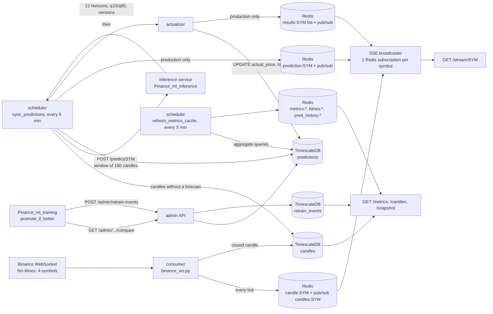
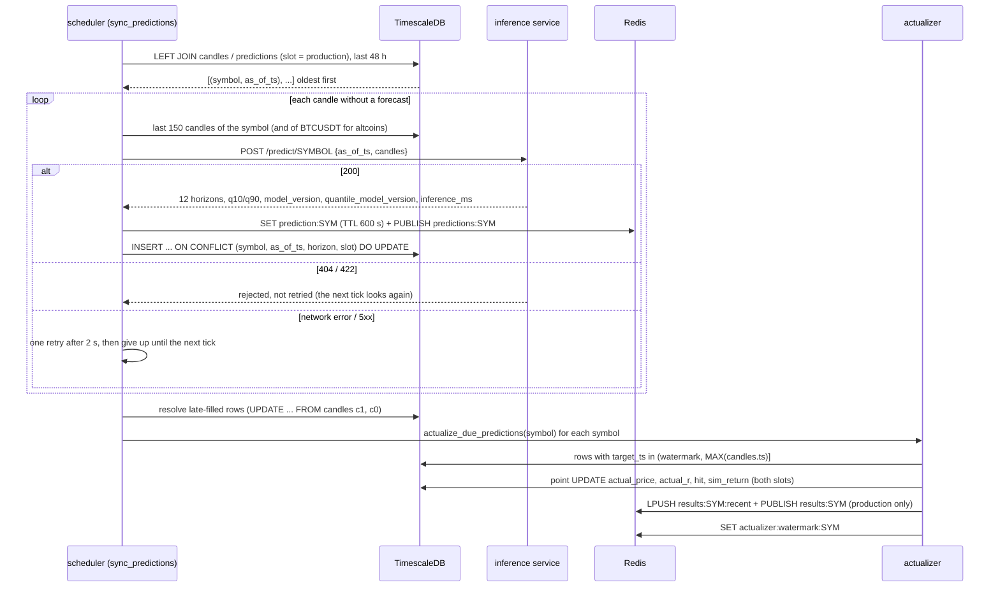
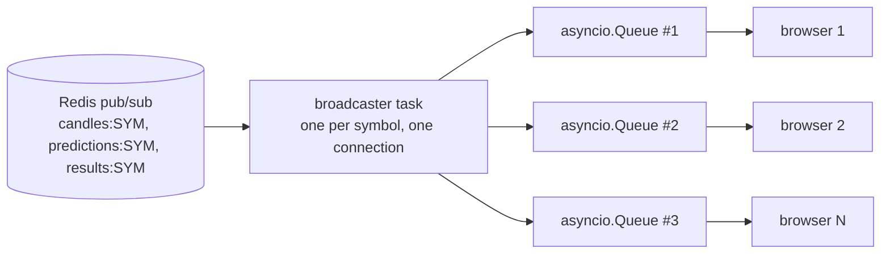
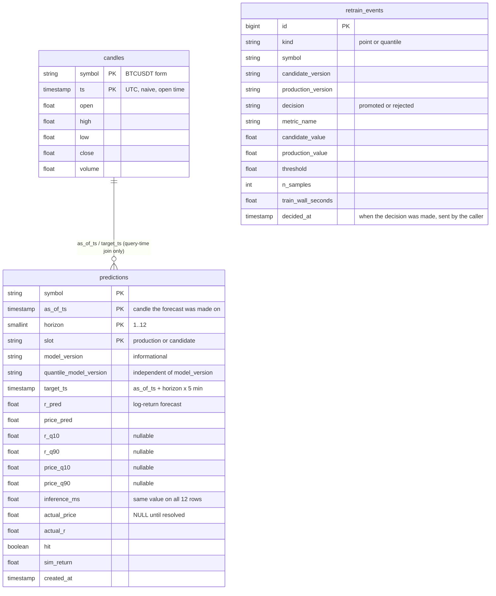

# Architecture

How the backend is put together: processes, data flow, storage, caches. Every statement here was taken from the code in `app/`; the reasoning behind the choices is in [design-decisions.md](design-decisions.md).

- [One process, four activities](#one-process-four-activities)
- [Component diagram](#component-diagram)
- [One forecast tick, step by step](#one-forecast-tick-step-by-step)
- [Live fan-out to browsers (SSE)](#live-fan-out-to-browsers-sse)
- [Data model](#data-model)
- [Redis keys](#redis-keys)
- [Scheduled jobs](#scheduled-jobs)
- [Symbols and naming](#symbols-and-naming)

## One process, four activities

The backend is a single FastAPI process (`app/main.py`). Its `lifespan` starts, in this order: the Redis pool, the APScheduler, and the Binance WebSocket consumer as an `asyncio` task. On shutdown it stops the scheduler, cancels the consumer (waiting up to 8 s), stops the SSE broadcasters, closes Redis and disposes the database engine.

| Activity | Module | What it does |
|---|---|---|
| Ingest | `app/ingest/binance_ws.py` | one WebSocket connection for four symbols; every tick goes to Redis, every closed 5-minute candle goes to TimescaleDB |
| Forecasting | `app/scheduler/jobs.py`, `app/inference/predictor.py` | finds candles without a forecast, sends each one's window to the inference service, stores the answer |
| Resolving | `app/ingest/actualizer.py` | when a forecast's target candle exists, writes the realised outcome onto the forecast row and publishes it |
| Serving | `app/api/*` | REST for candles and metrics, SSE for the live feed, an admin API for the training side |

The inference service (`Pinance_ml_inference`) and the training pipeline (`Pinance_ml_training`) are separate repositories; this process talks to the first over HTTP and is called by the second (`/admin/*`).

## Component diagram

## One forecast tick, step by step

`sync_predictions` runs at second 10 of every fifth minute (`CronTrigger(minute="*/5", second=10)`); the offset gives the WebSocket consumer time to write the candle that just closed.

Properties that follow from this shape:

- **The backlog is a query, not a queue.** A candle without a forecast is simply a row of `candles` with no matching row in `predictions`. An outage, a restart or a skipped tick leaves such rows behind, and the next tick finds and fills them. The request is self-contained (`as_of_ts` plus the candle window), so repeating it for an old candle is safe.
- **The scan is bounded to 48 hours** (`ML_GAP_LOOKBACK_HOURS`), so a new symbol that does not yet have 150 candles of history cannot make the scheduler knock on the inference service forever.
- **One bad candle does not stop the rest.** Each candle is wrapped in its own `try/except`.
- **Shadow forecasting is a separate job** (`sync_predictions_shadow`, only if `ML_SHADOW_ENABLED=true`), offset by 15 s. It calls `/predict/SYM/shadow`, stores under `slot = 'candidate'` and never publishes to Redis.

## Live fan-out to browsers (SSE)

- A broadcaster for a symbol starts when the first client connects and keeps one Redis subscription for all clients of that symbol. Each client reads from its own `asyncio.Queue` (maximum 200 items); when a slow client's queue is full, new events for that client are dropped instead of blocking the others.
- The broadcaster reconnects after a Redis error with exponential backoff, 1 s up to 60 s.
- Events: `tick` (every Binance kline update; in the captured stream roughly one every 1-2 s), `prediction` (a new forecast), `result` (a forecast that has matured, one event per horizon), and `ping` after 15 s of silence.
- The server ends a stream after 3,600 s of silence: the counter behind `_MAX_CONNECTION_AGE` grows only on 15-second keep-alive pings and is reset by any event, so while ticks keep arriving the server does not close the connection. Clients should still be able to reconnect. `GET /snapshot/{symbol}` gives the current state in one JSON for the first paint: last candle, current forecast, last 240 results.

A real 12-second capture is in [`examples/live/sse-12s.txt`](examples/live/sse-12s.txt); a capture across a 5-minute boundary, with `prediction` and `result` events, is in [`examples/live/sse-boundary.txt`](examples/live/sse-boundary.txt).

## Data model

Three tables, created by Alembic (`app/db/migrations`, one head: `d9e4b6f8c3a5`). There are no foreign keys: `predictions` is joined to `candles` by `(symbol, as_of_ts)` and `(symbol, target_ts)` in queries only.

| Table | Storage | Retention | Written by |
|---|---|---|---|
| `candles` | hypertable on `ts`, 1-day chunks | none (the 90-day policy was added by the first migration and removed by `d5bf66f7974f`) | WebSocket consumer, `app.backfill.run` |
| `predictions` | hypertable on `as_of_ts`, 7-day chunks | 90 days (`add_retention_policy`) | `predictor` (insert/upsert), `actualizer` and `resolve_predictions` (update) |
| `retrain_events` | plain table, index on `(symbol, kind, decided_at)` | none | `POST /admin/retrain-events` |

Notes on `predictions`:

- `actual_price`, `actual_r`, `hit`, `sim_return` are `NULL` until the target candle exists. `hit` is `sign(r_pred) = sign(actual_r)`; `sim_return` is `sign(r_pred) * actual_r` and is only meaningful for `horizon = 1` (see [metrics.md](metrics.md)).
- A partial index `ix_predictions_resolved (symbol, slot, target_ts) WHERE actual_price IS NOT NULL` serves almost every read.
- `inference_ms` is the duration of the whole `/predict` call (all 12 horizons), copied onto all 12 rows. The latency endpoint therefore filters `horizon = 1`.
- Timestamps are stored as naive UTC.

## Redis keys

| Key / channel | Type, TTL | Written by | Read by |
|---|---|---|---|
| `candle:{SYM}` | string, none | consumer, every tick | `/snapshot`, `/candles/{SYM}/latest` |
| `candles:{SYM}` | pub/sub | consumer | SSE `tick` |
| `prediction:{SYM}` | string, 600 s | predictor (production only) | `/snapshot` |
| `predictions:{SYM}` | pub/sub | predictor | SSE `prediction` |
| `results:{SYM}:recent` | list, 240 items, 7,200 s | actualizer | `/snapshot` |
| `results:{SYM}` | pub/sub | actualizer | SSE `result` |
| `actualizer:watermark:{SYM}` | string, 7 days | actualizer | actualizer |
| `metrics:{summary,coverage,history,errors,width_histogram,scatter,coverage_history,latency,retrain_timeline}:{SYM}:...` | string (JSON); 900 s when written by the scheduler, 45 s (summary, coverage) or 120 s (others) when computed on demand | scheduler, routes | routes |
| `pred_history:{SYM}:{horizon}:{hours}` | string, 900 s scheduled / 120 s on demand | scheduler, route | route |
| `prediction_log:{SYM}:{limit}` | string, 900 s scheduled / 120 s on demand (first page only) | scheduler, route | route |
| `klines:{SYM}:{timeframe}` | string, 300 s (1D, 1W), 600 s (1M), 3,600 s (1Y, ALL) | scheduler (1D), routes | routes |

`{SYM}` is the display form, `BTC/USDT`.

## Scheduled jobs

| Job id | Schedule | `max_instances` | What it does |
|---|---|---|---|
| `sync_ml_predictions` | `*/5` minutes, second 10 | 2 | fill production gaps, resolve late-filled rows, run the actualizer |
| `sync_ml_predictions_shadow` | `*/5` minutes, second 15; only if `ML_SHADOW_ENABLED` | 1 | the same for `candidate` |
| `refresh_metrics_cache` | `*/5` minutes (`METRICS_REFRESH_INTERVAL_MINUTES`), `misfire_grace_time` 300 s | 1 | recompute all cached aggregates for the four symbols |

A skipped tick (`max_instances` reached, or misfire) is logged as `scheduler.tick_skipped` at error level.

## Symbols and naming

`app/inference/registry.py` is the single list of supported pairs: `BTC/USDT`, `ETH/USDT`, `SOL/USDT`, `BNB/USDT`. Input is normalised (`btcusdt`, `BTC-USDT`, `BTC%2FUSDT` all become `BTC/USDT`); anything else gets HTTP 400. The database and the inference service use the Binance form (`BTCUSDT`); Redis keys and API responses use the display form. For altcoins the inference request also carries a `BTCUSDT` window, because the model uses BTC returns as a cross-asset feature.
