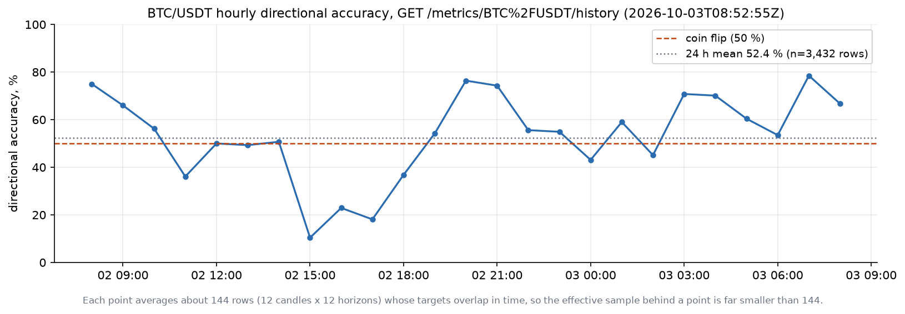
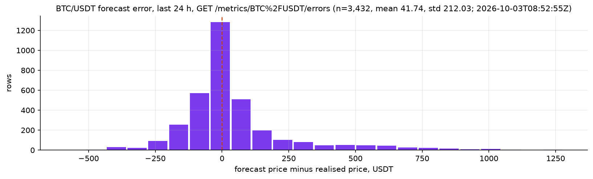

# Metrics: definitions, live values, how to read them

What the backend computes about its own forecasts, exactly as the SQL in `app/api/metrics.py` and `app/api/admin.py` defines it. Live numbers are real read-only responses from the public deployment, captured 2026-10-03 ~08:52 UTC (see [`examples/live/`](examples/live/)); they change every five minutes.

> **Not a trading signal and not financial advice.** A 5-minute forecast horizon is close to the limit of predictability, and these metrics exist to show that honestly.

## What is counted

Every metric is computed over **resolved production rows**: `slot = 'production'`, `actual_price IS NOT NULL`, `target_ts` inside the window and not in the future. One candle yields up to 12 rows (one per horizon), so **`n` counts rows, not independent observations**: the 24 h window with `n = 3,432` is 286 candles x 12 horizons, and the 12 targets that share a candle overlap in time. Windows: `1h`, `24h`, `7d`, `30d`, `all` (everything still stored; `predictions` has a 90-day retention policy).

## Definitions

| Metric | Definition (per window) | Endpoint |
|---|---|---|
| `directional_accuracy` | `100 * mean(hit)`, `hit = sign(r_pred) = sign(actual_r)`, `actual_r = ln(close_target / close_as_of)`; all 12 horizons pooled | `/summary`, `/history?metric=accuracy` |
| `delta_accuracy` | accuracy in the window minus accuracy in the preceding window of the same length; `null` if there is no preceding data | `/summary` |
| `mae` | `mean(abs(price_pred - actual_price))`, in quote currency (USDT) | `/summary`, `/history?metric=mae` |
| `rmse` | `sqrt(mean((price_pred - actual_price)^2))` | `/summary` |
| `sharpe`, `sharpe_n` | `mean(sim_return) / std(sim_return) * sqrt(105,120)` over `horizon = 1` rows only, `sim_return = sign(r_pred) * actual_r`; `sharpe_n` is the row count; `null` if the std is 0 or `sharpe_n < 2`. No fees, no slippage | `/summary` |
| `q10_coverage` | share of rows with `actual_price < price_q10`; a calibrated 10 % quantile gives 0.10 | `/coverage`, `/coverage_history`, admin `compare` |
| `q90_coverage` | share of rows with `actual_price < price_q90`; a calibrated 90 % quantile gives 0.90 | same |
| `avg_width` | `mean(price_q90 - price_q10)` | `/coverage_history`; mean and std in `/width_histogram` |
| `pinball_loss` | mean of the two pinball losses at 0.1 and 0.9, computed on log-returns (`actual_r`, `r_q10`, `r_q90`), per bucket | `/coverage_history` |
| `r2` | `1 - SS_res / SS_tot` on prices of the whole window (the scatter shows a systematic sample) | `/scatter` |
| latency `p50/p95/p99` | `percentile_cont` of `inference_ms` over `horizon = 1` rows by `as_of_ts`; `inference_ms` is the whole 12-horizon call on the inference service | `/latency` |

Price-space errors (`mae`, `rmse`, `errors`) mix horizons and are dominated by the price level; they are comparable over time for one symbol, not across symbols. A comparison with the naive "no change" forecast is made offline in the training repository, not here.

## Live values, BTC/USDT, 2026-10-03

From [`examples/live/summary.json`](examples/live/summary.json), `updated_at` 2026-10-03T08:50:05Z:

| Window | Directional accuracy | n (rows) | Candles (`sharpe_n`) | 95 % interval if candles were the unit* | MAE (USDT) | Sharpe |
|---|---|---|---|---|---|---|
| 1 h | 63.3 % | 120 | 10 | +/- 30 pp | 27.03 | -31.4 |
| 24 h | 52.4 % | 3,432 | 286 | +/- 5.8 pp | 126.22 | 2.81 |
| 7 d | 52.2 % | 24,168 | 2,014 | +/- 2.2 pp | 143.91 | 0.96 |
| 30 d | 52.7 % | 103,356 | 8,613 | +/- 1.1 pp | 141.26 | -2.38 |
| all | 52.5 % | 236,314 | 19,700 | +/- 0.7 pp | 128.62 | 0.59 |

\* My approximation, not an API field: a binomial interval `1.96 * sqrt(p(1-p)/N)` with `N` = candles (`sharpe_n`) instead of rows. It ignores autocorrelation between candles, so it is a lower bound on the real uncertainty.

Reading, without overstating it:

- Over the long windows the accuracy sits at 52-53 %, above a coin flip by an amount that is small but larger than the approximate interval for the 30 d and all-time windows (+/- 1.1 and 0.7 pp). The short windows say nothing: a 24 h figure of 52.4 % has an interval of about +/- 5.8 pp.
- The Sharpe sign changes between windows (+2.81, +0.96, -2.38, +0.59) and the 1 h value is computed from 10 samples. Treat it as noise.
- The offline walk-forward results that these live numbers should be compared with are in `Pinance_ml_training`.

### Corridor calibration

From [`examples/live/coverage.json`](examples/live/coverage.json):

| Window | n | q10 coverage (target 10 %) | q90 coverage (target 90 %) |
|---|---|---|---|
| 1 h | 120 | 1.7 % | 98.3 % |
| 24 h | 3,432 | 8.6 % | 96.9 % |
| 7 d | 24,168 | 4.7 % | 91.7 % |
| 30 d | 103,356 | 4.5 % | 92.0 % |
| all | 171,538 | 4.5 % | 91.3 % |

*Corridor calibration for BTC/USDT, drawn by [`figures/make_figures.py`](figures/make_figures.py) from `examples/live/coverage.json`. The lower bound is hit less than half as often as intended over long windows, so the corridor's lower edge is too low (too conservative); the upper edge is close to its target.*

The 24 h row differs from the long windows (8.6 % / 96.9 %), another sign that short windows are noisy; no explanation is attempted here.

### Hourly accuracy and error distribution

*Hourly directional accuracy of BTC/USDT from `examples/live/history-accuracy.json` (`/history?metric=accuracy&window=24h&bucket=1h`). Each point is about 144 overlapping rows.*

*Forecast error histogram from `examples/live/errors.json` (n = 3,432, mean +41.74, std 212.03 USDT).*

### Latency

[`examples/live/latency.json`](examples/live/latency.json): over 24 h, `n = 286` calls, p50 118.4 ms, p95 722.1 ms, p99 864.5 ms. This is the inference service's own timing, not including the network round trip from the backend.

## Comparison for promotion (admin)

`GET /admin/metrics/{symbol}/compare` repeats the point metrics (`n`, accuracy, MAE, RMSE) grouped by `(slot, model_version)` and the corridor coverage grouped by `(slot, quantile_model_version)`, over the same five windows, on the same realised outcomes. The training repository reads one window (usually `7d`) from it. A real response from the live deployment could not be captured (the endpoint is not reachable through the public domain); [`examples/admin-offline/`](examples/admin-offline/) holds responses from the real code run against synthetic data, produced by [`examples/admin_offline_demo.py`](examples/admin_offline_demo.py). Their numbers carry no information about model quality.
